# Architecture for version 0.10.15

## Table of contents
* [Overview](#overview-a-nameoverview)
* [Components](#components)
* [Sequence diagrams](#sequence-diagrams)
    1. [File api](#1-file-api)
    2. [Transform api](#2-transform-api)
    3. [Inference api](#3-inference-api)

## Overview
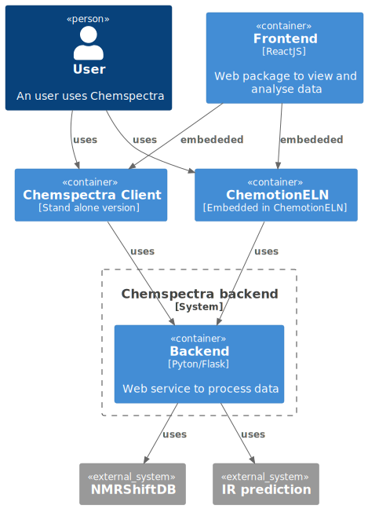

## Components
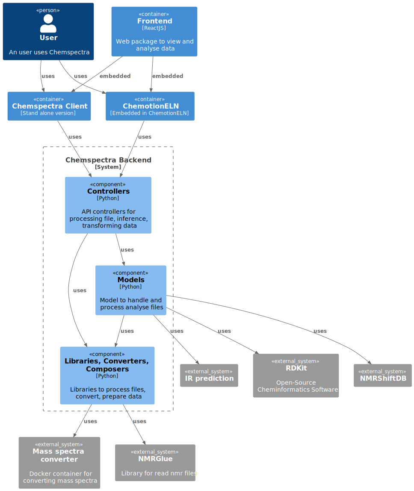

## Sequence diagrams
### 1. File api

#### *a. Convert file*
```
Endpoint:
/api/v1/chemspectra/file/convert  [POST]
```
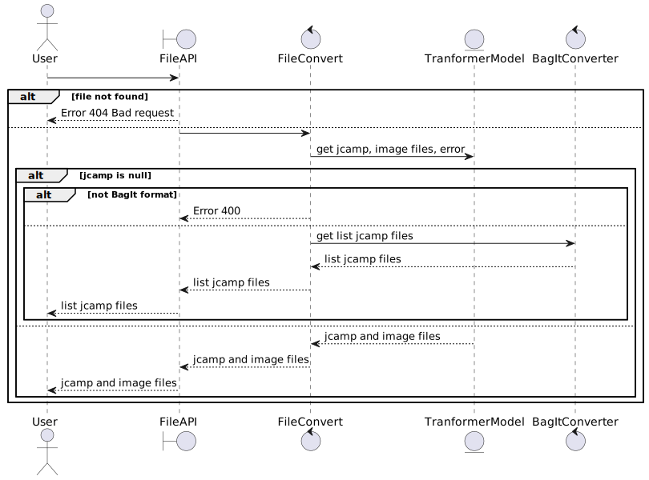

#### *b. Convert molfile*
```
Endpoint: 
/api/v1/chemspectra/molfile/convert [POST]
```
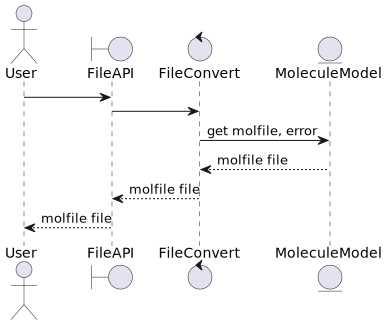

#### *c. Refresh file*
```
Endpoint: 
/api/v1/chemspectra/file/refresh [POST]
```
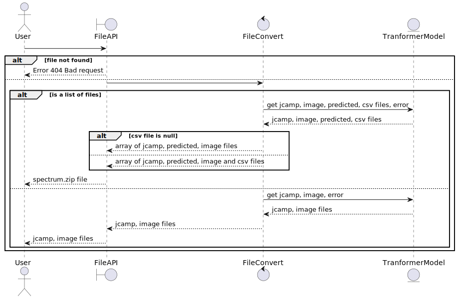

#### *d. Save file*
```
Endpoint: 
/api/v1/chemspectra/file/save [POST]
```
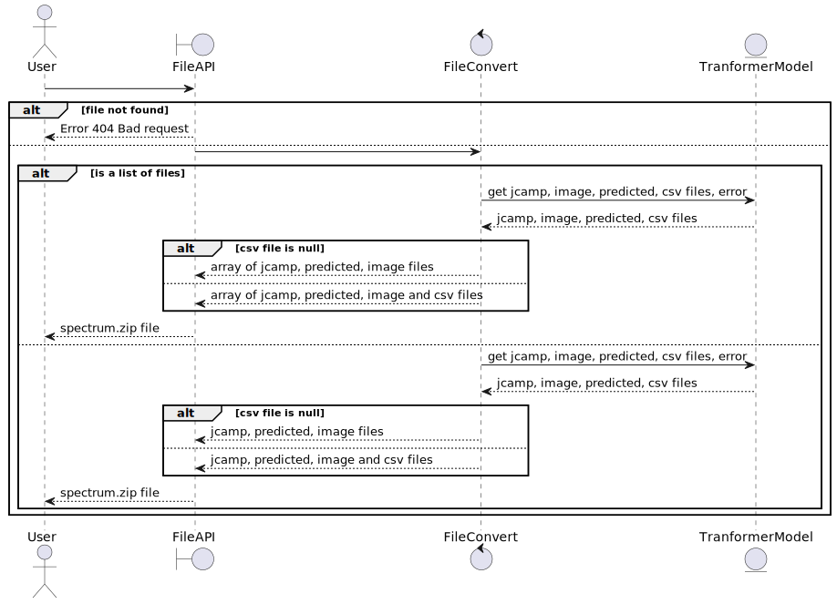

### 2. Transform api
#### *a. Transform to get jcamp files and images as zip format*
```
Endpoint:
/zip_jcamp_n_img  [POST]
```
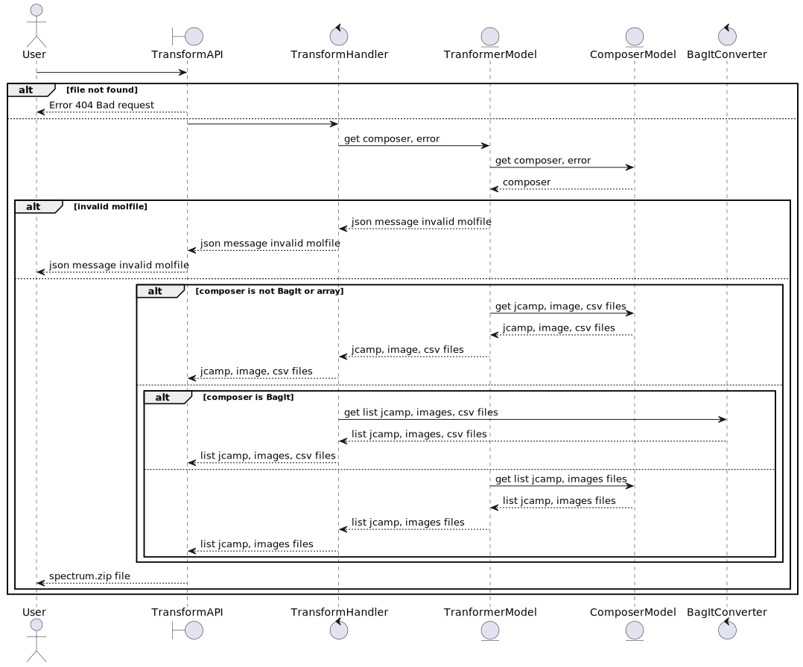

#### *b. Transform to get jcamp files as zip format*
```
Endpoint:
/zip_jcamp  [POST]
```


#### *c. Transform to get image as zip format*
```
Endpoint:
/zip_image  [POST]
```
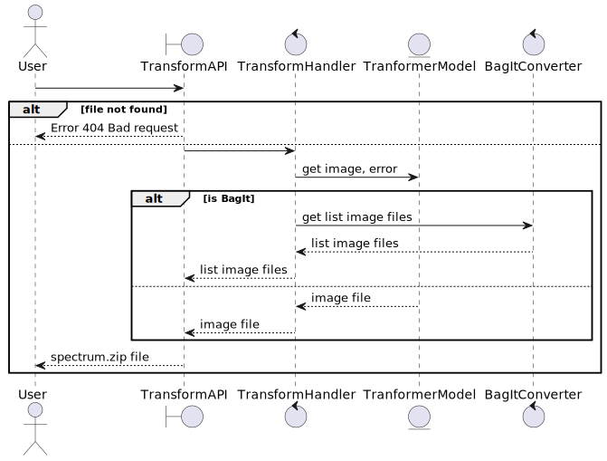

#### *d. Transform to get jcamp file*
```
Endpoint:
/jcamp  [POST]
```
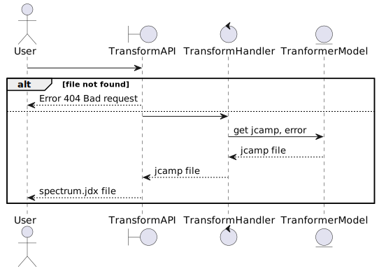

#### *e. Transform to get image in PNG format*
```
Endpoint:
/image  [POST]
```


### 3. Inference api

#### *a. Predict NMR signals with peaks data as FORM request*
```
Endpoint:
/predict/by_peaks_form  [POST]
/api/v1/chemspectra/predict/nmr_peaks_form [POST]
```
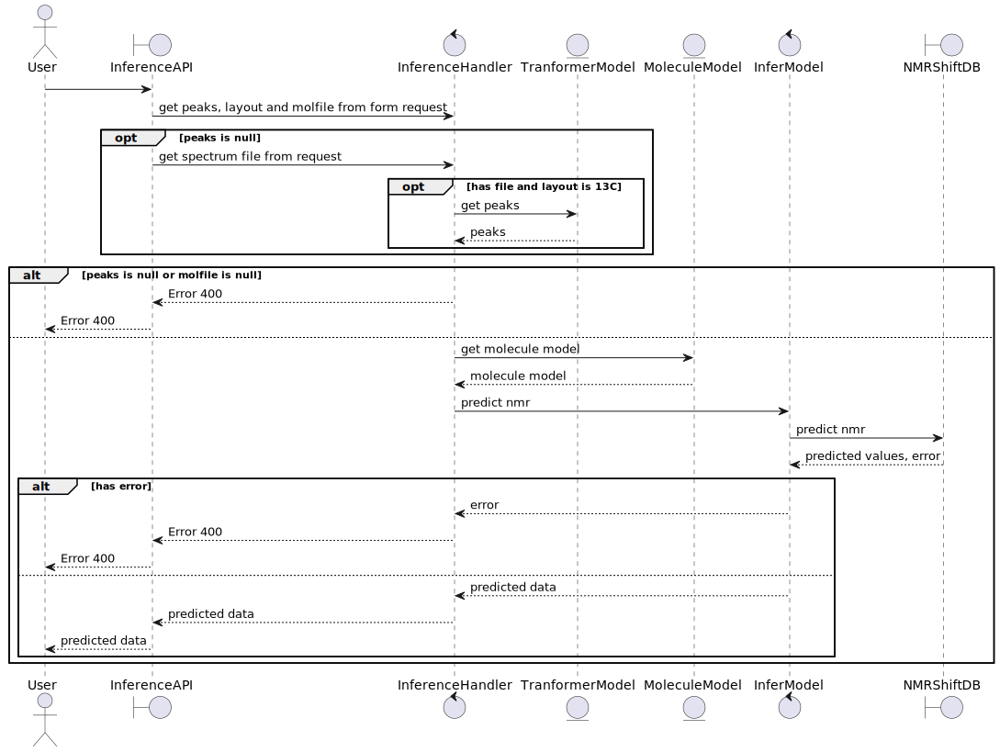

#### *b. Predict NMR signals with peaks data as JSON request*
```
Endpoint:
/predict/by_peaks_json  [POST]
/api/v1/chemspectra/predict/nmr_peaks_json [POST]
```
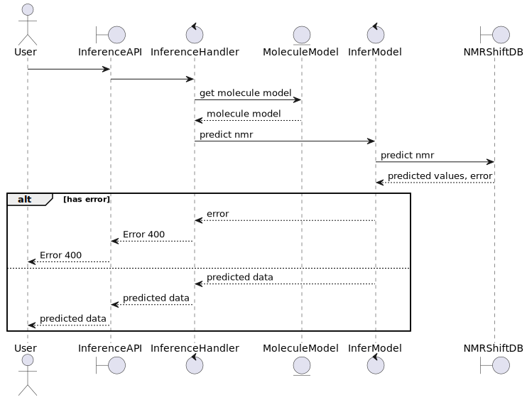

#### *c. Predict Mass spectrum*
```
Endpoint:
/predict/ms  [POST]
/api/v1/chemspectra/predict/ms [POST]
```
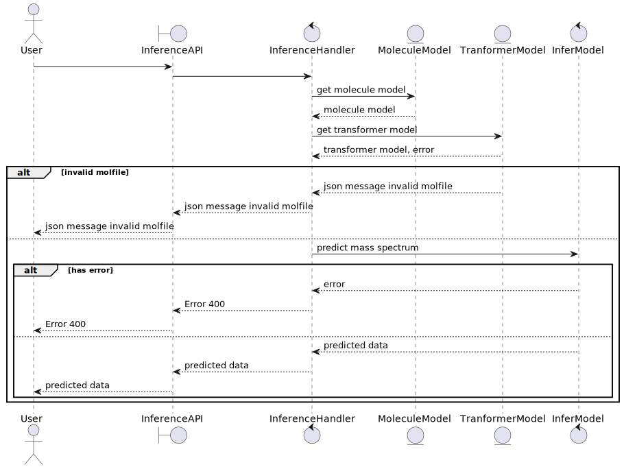

#### *d. Predict Mass spectrum*
```
Endpoint:
/predict/infrared  [POST]
/api/v1/chemspectra/predict/infrared [POST]
```
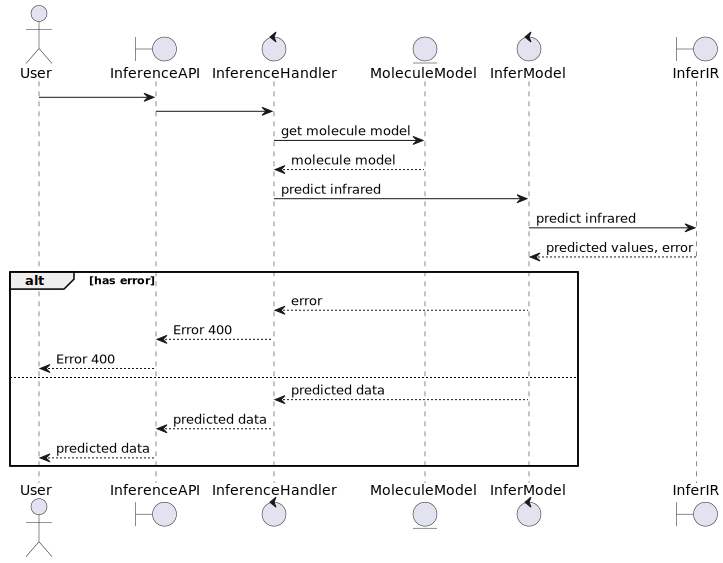
