# Backend Architecture

This document describes the internal architecture of `chem-spectra-app` for developers who need to modify the backend safely.

It focuses on code structure, system boundaries, and the main data handoffs. For first-time project context, read `docs/onboarding.md` first. For runtime execution paths, read `docs/core-flows.md`.

## 1. Architecture Overview

`chem-spectra-app` is a modular Flask monolith.

  

 
The application runs as one Flask app, created by `create_app()` in `chem_spectra/__init__.py`. The WSGI entrypoint is `server.py`, which exposes `app = create_app()` for Gunicorn.

The code is organized into three main layers:

| Layer | Main path | Primary responsibility |
|---|---|---|
| Controller | `chem_spectra/controller/` | HTTP request handling, input extraction, response formatting |
| Model | `chem_spectra/model/` | Application orchestration and workflow decisions |
| Lib | `chem_spectra/lib/` | Domain-specific conversion, composition, chemistry, and shared utilities |

The application is not split into separate backend services in this repository. It registers multiple Flask blueprints in a single app:

- `file_api` from `chem_spectra/controller/file_api.py`
- `infer_api` from `chem_spectra/controller/inference_api.py`
- `trans_api` from `chem_spectra/controller/transform_api.py`
- `spectra_layout_api` from `chem_spectra/controller/spectra_layout_api.py`

The backend is mostly file-oriented:

- it receives uploaded files;
- reads file content into wrappers such as `FileContainer`;
- writes temporary files for libraries that need paths;
- converts spectra into generated outputs;
- returns JSON, direct files, or ZIP archives.

`chem-spectra-app` processes uploaded files in request-scoped workflows and returns generated outputs to callers.

In the Chemotion ELN integration, the ELN Rails backend stores generated results as attachments after proxying requests to `chem-spectra-app`.

## 2. Layer Responsibilities

### Controller Layer

Path: `chem_spectra/controller/`

The controller layer is responsible for HTTP-level behavior.

It should contain:

- Flask route declarations.
- Request parsing.
- Upload extraction through `FileContainer`.
- Form parameter extraction through `extract_params()`.
- Calling model-layer classes.
- Response formatting through `jsonify()`, `send_file()`, ZIP helpers, or `abort(...)`.
- HTTP-specific behavior such as response headers.

Important files:

- `chem_spectra/controller/file_api.py`
- `chem_spectra/controller/transform_api.py`
- `chem_spectra/controller/inference_api.py`
- `chem_spectra/controller/spectra_layout_api.py`
- `chem_spectra/controller/helper/file_container.py`
- `chem_spectra/controller/helper/share.py`

Logic that belongs in controllers:

- Selecting the endpoint contract.
- Reading `request.files`, `request.form`, or `request.json`.
- Constructing the correct model call.
- Returning the result in the expected HTTP format.

Logic that should not be placed in controllers:

- Format parsing logic.
- Spectral calculations.
- RDKit molecule processing.
- Matplotlib rendering logic.
- External prediction protocol details beyond calling the model.
- Reusable conversion decisions that belong in `TransformerModel`.

Examples:

- `file_api.py` handles versioned file conversion, refresh, save, and molfile conversion endpoints.
- `transform_api.py` handles transformation-oriented endpoints such as `/zip_jcamp_n_img`, `/jcamp`, `/image`, `/nmrium`, and `/combine_images`.
- `inference_api.py` handles prediction routes and delegates NMR, IR, and MS logic to `InferencerModel`.
- `spectra_layout_api.py` reads the JCAMP data type mapping and returns it as JSON.

#### Controller Endpoint Map

The controller surface is easier to understand by grouping routes by blueprint and response type.

  

 

Blueprint responsibilities:

- `file_api` exposes the versioned API for file conversion, save, refresh, and molfile conversion.
- `transform_api` exposes transformation helpers that return ZIP archives or direct generated files.
- `inference_api` exposes NMR, IR, and MS prediction routes.
- `spectra_layout_api` exposes the JCAMP layout mapping used by clients.

For the exact route, handler, main input, and main output table, see `docs/api-reference.md`.

### Model Layer

Path: `chem_spectra/model/`

The model layer is responsible for application-level orchestration. It connects HTTP requests to lower-level libraries without being tied to Flask response formatting.

It should contain:

- Workflow decisions.
- Coordination between converters and composers.
- Coordination between molecule processing and predictions.
- Handling of domain-level return shapes used by controllers.
- Integration points with external services.

Important files:

- `chem_spectra/model/transformer.py`
- `chem_spectra/model/inferencer.py`
- `chem_spectra/model/molecule.py`
- `chem_spectra/model/concern/property.py`

Logic that belongs in models:

- Deciding which conversion pipeline applies to a file.
- Calling the right converter and composer combination.
- Preparing data for external prediction services.
- Combining molecule-derived data with spectrum-derived data.
- Returning generated temporary files or structured prediction results.

Logic that should not be placed in models:

- Flask route declarations.
- Direct HTTP response construction.
- Low-level JCAMP parsing.
- Low-level Matplotlib drawing details.
- File-format-specific parsing that belongs in converters.
- Output-file rendering logic that belongs in composers.

### Lib Layer

Path: `chem_spectra/lib/`

The lib layer contains the domain-specific implementation details.

It should contain:

- File format parsers.
- Spectral data converters.
- Output composers.
- Chemistry helper code.
- Shared numerical and buffer utilities.
- Data preparation pipelines such as IR standardization.

Important subdirectories:

- `chem_spectra/lib/converter/`
- `chem_spectra/lib/composer/`
- `chem_spectra/lib/chem/`
- `chem_spectra/lib/data_pipeline/`
- `chem_spectra/lib/shared/`

Logic that belongs in `lib`:

- Reading JCAMP, Bruker FID, CDF, mzML, mzXML, RAW, BagIt, and NMRium inputs.
- Classifying spectrum types.
- Building JCAMP output.
- Rendering images.
- Generating CSV output.
- Reducing points, calculating peaks, handling integrations, and formatting spectral metadata.

Logic that should not be placed in `lib`:

- Flask request parsing.
- Endpoint-specific response construction.
- Application-wide routing decisions that choose an entire workflow.
- Production deployment configuration.

## 3. Key Components

### `TransformerModel`

File: `chem_spectra/model/transformer.py`

`TransformerModel` is the central orchestration class for spectrum transformation.

Its public methods are used by controllers to request different output shapes:

- `convert2jcamp()`
- `convert2img()`
- `convert2jcamp_img()`
- `to_composer()`
- `to_converter()`
- `tf_predict()`
- `tf_nmrium()`
- `tf_combine()`

#### Role

`TransformerModel` decides which conversion pipeline to use for a given uploaded file.

It chooses and wires together:

- a converter, which reads or normalizes the input;
- a composer, which produces output artifacts.

#### Decision Logic

The main decision point is `to_composer()`.

  

 

It checks:

- the uploaded filename extension via `self.file.name`;
- the requested extension override via `self.params['ext']`.

The main branches are:

| Input type | Pipeline |
|---|---|
| `raw`, `mzml`, `mzxml` | `MSConverter` -> `MSComposer` |
| `cdf` | `CdfBaseConverter` -> `CdfMSConverter` -> `MSComposer` |
| `zip` with Bruker `fid` | `FidBaseConverter` or `FidHasBruckerProcessed` -> `JcampNIConverter` -> `NIComposer` |
| `zip` with `bagit.txt` | `BagItBaseConverter` |
| JCAMP-like input | `JcampBaseConverter` -> `JcampMSConverter`/`MSComposer` or `JcampNIConverter`/`NIComposer` |

The ZIP path is more complex:

- `zip2cvp()` extracts the ZIP into a `TemporaryDirectory`.
- It searches for Bruker FID data through `search_brucker_binary()`.
- It checks whether processed Bruker data exists through `search_processed_file()`.
- It searches for BagIt data through `search_bag_it_file()`.
- It returns one of several shapes depending on the input: a single composer, a sequence of composers, a BagIt converter, or failure values.

#### Interaction With Converters and Composers

`TransformerModel` creates converters first, then composers.

Examples:

- `ms2composer()` creates `MSConverter` and then wraps it in `MSComposer`.
- `cdf2cvp()` writes the uploaded bytes to a temporary `.cdf` file, creates `CdfBaseConverter`, then `CdfMSConverter`, then `MSComposer`.
- `jcamp2cvp()` writes the uploaded text to a temporary file, creates `JcampBaseConverter`, then branches on `jbcv.typ`.
- Bruker ZIP conversion produces NMR-like converter data, then creates `JcampNIConverter` and `NIComposer`.

When modifying `TransformerModel`, be careful with return shapes. Some callers expect:

- `(converter, composer, invalid_molfile)`
- `(composer, invalid_molfile)`
- `False` values on failure
- `BagItBaseConverter` as both converter-like and composer-like object
- sequences of composers for processed Bruker ZIP data

The code currently assumes `self.params['ext']` exists in `to_composer()` and `to_converter()`. Some helpers can return `params=False` when no form parameters are present. If extending call paths, validate how `params` is constructed before invoking these methods.

### `InferencerModel`

File: `chem_spectra/model/inferencer.py`

`InferencerModel` orchestrates prediction workflows.

It supports:

- NMR prediction through `predict_nmr()`
- NMR simulation through `simulate_nmr()`
- IR prediction through `predict_ir()`
- MS prediction through `predict_ms()`

#### External Calls

NMR prediction calls:

- `current_app.config.get('URL_NSHIFTDB')`
- via `requests.post(...)`
- with `Content-Type: application/json`
- with `verify=False`

The NMR request body is built by `__build_data()` and includes:

- an `inputs` list with spectrum type and shifts;
- `moltxt` from `MoleculeModel`.

Supported NMR layouts in `__predict_nmr()` are:

- `1H`
- `13C`
- `19F`

IR prediction calls:

- `current_app.config.get('URL_DEEPIR')`
- via `requests.post(...)`
- with file data produced by `np.savez(...)`
- with functional groups from `MoleculeModel.fgs()`

Before calling DeepIR, IR data is standardized through `InfraredLib` in `chem_spectra/lib/data_pipeline/infrared.py`.

MS prediction uses local peak data from:

- `self.tm.prism_peaks()`
- `self.tm.core.thres`

The `tm` object is expected to be a mass spectrum composer created before calling `InferencerModel.predict_ms()`.

#### Error Handling

NMR prediction handles:

- `json.decoder.JSONDecodeError`, returning an outline with code `400`;
- `requests.ConnectionError`, logging the connection problem and returning an outline with code `503`.

IR prediction handles:

- `TypeError`, returning an outline with code `400`;
- `requests.ConnectionError`, returning an outline with code `503`.

MS prediction handles:

- `TypeError`, returning an outline with code `400`;
- `requests.ConnectionError`, returning an outline with code `503`.

`simulate_nmr()` catches broad exceptions, logs them, and returns an empty list.

#### Runtime Flow Reference

For step-by-step NMR, IR, and MS execution paths, see `docs/core-flows.md`.

This architecture document keeps the structural boundary clear:

- controllers collect request input;
- `MoleculeModel` prepares molecule-derived data;
- `InferencerModel` coordinates prediction workflows;
- external services or composers provide prediction results.

### `MoleculeModel`

File: `chem_spectra/model/molecule.py`

`MoleculeModel` wraps RDKit molecule handling.

#### Responsibilities

It is responsible for:

- reading molfile content from either a string or a `FileContainer`;
- creating a RDKit molecule via `Chem.MolFromMolFile()`;
- generating canonical SMILES with `Chem.MolToSmiles()`;
- computing exact molecular weight with `Descriptors.ExactMolWt()`;
- generating molecule SVG with `Draw.MolDraw2DSVG`;
- adding hydrogens and 2D coordinates for `1H` layout when `decorate=True`;
- identifying functional groups through `chem_spectra/lib/chem/ifg.py`.

#### RDKit Usage

RDKit is used directly in this model:

- `Chem.MolFromMolFile()`
- `Chem.MolToSmiles()`
- `Chem.AddHs()`
- `AllChem.Compute2DCoords()`
- `Chem.MolToMolBlock()`
- `Descriptors.ExactMolWt()`
- `Draw.MolDraw2DSVG()`
- `Chem.MolFromSmarts()`
- `Chem.MolToSmarts()`

#### Limitations

The class assumes that RDKit can parse the molfile content. When `self.mol` is false or invalid, methods such as `Chem.MolToSmiles(self.mol, ...)` fail.

`__set_mol()` contains `tf.close` without calling it as `tf.close()`. This is a maintenance risk around temporary file cleanup.

Behavior for every invalid molfile scenario is not fully normalized in `MoleculeModel`. Some invalid molfile handling is performed indirectly in `decorate_sim_property()` in `chem_spectra/model/concern/property.py`.

## 4. Internal Boundaries and Data Handoffs

### Request to Response Handoffs

The diagram below shows the main component handoffs for conversion requests. For step-by-step runtime paths and debugging checkpoints, see `docs/core-flows.md`.

  

 

Architectural ownership:

- controllers own request extraction and response formatting;
- `FileContainer` owns uploaded file wrapping;
- `extract_params()` owns form parameter extraction;
- `TransformerModel` owns conversion route selection;
- converters own input parsing and normalization;
- composers own output generation;
- ZIP helpers own response packaging.

### Parameter Flow

`extract_params()` centralizes many frontend-controlled form fields, including:

- `scan`
- `thres`
- `mass`
- `ext`
- `predict`
- `integration`
- `multiplicity`
- `simulatenmr`
- `wave_length`
- `axes_units`
- `cyclic_volta`
- `jcamp_idx`
- `list_file_names[]`
- `data_type_mapping`
- `detector`
- `dsc_meta_data`

Downstream converters and composers depend on these fields after normalization by `parse_params()` in `chem_spectra/lib/converter/share.py`.

For runtime failure modes around `params=False`, `params['ext']`, and malformed JSON-like fields, see `docs/core-flows.md`.

When adding a new parameter:

- add extraction in `extract_params()`;
- normalize it in `parse_params()` if it is used by converters or composers;
- add tests for at least one endpoint that passes the parameter.

### Converter and Composer Interaction

Converters are input-oriented. They answer: "What data is in this file?"

Composers are output-oriented. They answer: "How should this normalized data be written or rendered?"

Examples:

- `JcampBaseConverter` reads JCAMP and classifies the spectrum.
- `JcampNIConverter` converts non-MS JCAMP data into the shape expected by `NIComposer`.
- `JcampMSConverter` converts MS JCAMP data into the shape expected by `MSComposer`.
- `MSConverter` reads or prepares mass spectrometry data from RAW, mzML, or mzXML.
- `NIComposer` writes JCAMP-like output, renders PNG images, and can produce CSV data for supported non-MS workflows.
- `MSComposer` writes mass-spectrum JCAMP output, renders MS images, and exposes `prism_peaks()`.

### Temporary Files

Temporary files are used because several parsing and rendering libraries operate on file paths or file-like objects.

Relevant helpers:

- `FileContainer.temp_file()` in `chem_spectra/controller/helper/file_container.py`
- `store_str_in_tmp()` in `chem_spectra/lib/shared/buffer.py`
- `store_byte_in_tmp()` in `chem_spectra/lib/shared/buffer.py`

Common temporary-file patterns:

- Uploaded bytes are written to a temporary file before CDF parsing.
- JCAMP text is written to a temporary file before `nmrglue` parsing.
- ZIP files are written to a temporary file before extraction.
- Generated JCAMP, PNG, and CSV outputs are returned as temporary files.
- ZIP responses are built in memory with `io.BytesIO`.

ZIP handling:

- `FileContainer` checks ZIP file contents against `MAX_ZIP_SIZE`.
- `TransformerModel.zip2cvp()` extracts ZIP content into `TemporaryDirectory`.
- `to_zip_response()` and `to_zip_bag_it_response()` package generated temporary files into ZIP responses.

Be careful to close generated temporary files after packaging. The ZIP helpers close some temporary files, but not every return path has identical cleanup behavior.

## 5. File Structure Explained

### `chem_spectra/controller/`

Contains Flask blueprints and HTTP helpers.

Use this directory when:

- adding or modifying API endpoints;
- changing request/response contracts;
- changing upload parsing;
- changing ZIP response behavior;
- adding endpoint tests.

Do not place spectral parsing or rendering logic here.

### `chem_spectra/model/`

Contains application orchestration classes.

Use this directory when:

- changing which pipeline handles a file type;
- changing prediction workflows;
- changing molecule-level behavior;
- coordinating multiple lower-level libraries.

Do not place Flask response formatting here.

### `chem_spectra/lib/`

Contains the lower-level domain implementation.

Use this directory when:

- changing format parsing;
- changing generated JCAMP output;
- changing image rendering;
- changing chemistry helpers;
- changing shared calculations or buffers.

### `chem_spectra/lib/converter/`

Contains format-specific readers and normalizers.

Important areas:

- `jcamp/` for JCAMP parsing and classification.
- `fid/` for Bruker FID handling.
- `cdf/` for CDF mass spectrum input.
- `bagit/` for BagIt archives.
- `nmrium/` for NMRium JSON conversion.
- `ms.py` for RAW, mzML, and mzXML mass spectrum workflows.
- `datatable.py` for JCAMP-style data table encoding.
- `share.py` for parameter normalization and shared converter helpers.

Modify this layer when the input data format changes.

### `chem_spectra/lib/composer/`

Contains output-generation logic.

Important files:

- `base.py` for common JCAMP output sections, metadata, peak tables, integration, and multiplicity support.
- `ni.py` for NMR and many non-MS output workflows.
- `ms.py` for mass spectrum output and peak extraction.

Modify this layer when generated output changes.

## 6. External Dependencies

### `msconvert`

Used in: `chem_spectra/lib/converter/ms.py`

`MSConverter` depends on an external Docker container named `msconvert_docker` for RAW mass spectrometry conversion.

The command is built in `__build_cmd_msconvert()` and uses:

- `docker`
- `exec`
- `msconvert_docker`
- `wine`
- `msconvert`
- files under `/data/{hash}/...`

The local temporary path is `./chem_spectra/tmp`.

Operational requirements:

- `chem_spectra/tmp` must exist and be mounted into the container as `/data`.
- A running container named `msconvert_docker` is expected.
- RAW conversion runs with `subprocess.run(..., timeout=10)`.

`Dockerfile.p2d` references `fake-docker.py` as part of the P2D image setup.

### NMRShiftDB

Used in: `chem_spectra/model/inferencer.py`

Configuration key:

- `URL_NSHIFTDB`

Used by:

- `InferencerModel.__predict_nmr()`
- `InferencerModel.simulate_nmr()`
- `decorate_sim_property()` indirectly when simulation is enabled

The code posts JSON data and disables TLS verification with `verify=False`.

Supported layouts in code:

- `1H`
- `13C`
- `19F`

If the service is unavailable, `predict_nmr()` catches `requests.ConnectionError`, logs the issue, and returns an outline with code `503`.

### DeepIR

Used in: `chem_spectra/model/inferencer.py`

Configuration key:

- `URL_DEEPIR`

Used by:

- `InferencerModel.__predict_ir()`

Input preparation:

- `InfraredLib` standardizes the spectrum.
- `MoleculeModel.fgs()` provides functional groups.
- NumPy writes standardized data into an in-memory `.npz` payload.

If the service is unavailable, `predict_ir()` catches `requests.ConnectionError` and returns an outline with code `503`.

### nmrglue

Used in:

- `chem_spectra/lib/converter/jcamp/base.py`
- `chem_spectra/lib/converter/fid/base.py`
- `chem_spectra/lib/converter/fid/bruker.py`
- `chem_spectra/lib/converter/nmrium/base.py`

`nmrglue` is a Python dependency used by converter code to read JCAMP, Bruker FID, and NMRium-related data. It is not an external runtime service, but it is part of the parsing boundary between uploaded scientific files and normalized converter data.

## 7. Design Decisions and Constraints

### Modular Flask Monolith

The codebase is structured as a single Flask application with internal modules rather than separate services.

This keeps endpoint registration and deployment simple, but it means shared workflows such as `TransformerModel` and `NIComposer` have a broad impact. Test changes in these areas across multiple endpoint families.

### Request-Scoped Processing

The service treats uploaded files as the source of truth for each request and returns generated artifacts directly.

Chemotion ELN handles persistence externally by storing generated results as attachments.

### Stateless Request-Oriented Design

The backend is mostly stateless at the application level:

- inputs arrive as request uploads;
- temporary files are created for processing;
- outputs are returned immediately to the caller.

Important exception:

- logs are written to `LOGS_FILE` or `./instance/logging.log`;
- `chem_spectra/tmp` is used by MS conversion workflows;
- generated temporary files exist during request processing.

### Reliance on External Services

Prediction and RAW conversion depend on services outside the Flask process:

- `URL_NSHIFTDB` for NMR prediction;
- `URL_DEEPIR` for IR prediction;
- `msconvert_docker` for RAW conversion.

When modifying related code, consider:

- timeout behavior;
- unavailable services;
- missing configuration;
- whether tests mock external calls;
- whether local development has the required containers running.

### File-Based Workflows

The architecture is strongly file-based because the supported scientific libraries and formats often expect files or file-like objects.

Practical constraints:

- File extensions influence routing.
- Some request parameters override extension-based decisions.
- ZIP archives can contain multiple logical spectra.
- Generated files are often temporary files with meaningful suffixes.
- ZIP responses are built from temporary files.

When adding a feature, decide whether the change belongs to:

- request handling in `controller`;
- workflow selection in `model`;
- input parsing in `lib/converter`;
- output generation in `lib/composer`.

This boundary is the most important guideline for avoiding regressions in core flows.

