# Core Runtime Flows

Runtime cheat sheet for the main execution paths in `chem-spectra-app`.

Use `docs/architecture.md` for structure. Use this document when you need to answer:

- What happens when this request runs?
- Where is the branch selected?
- Which input shape can break the flow?
- Where should debugging start?

## 1. Runtime Mental Model

Most requests run like this:

1. Read uploaded files and form fields.
2. Wrap files in `FileContainer`.
3. Convert request fields with `extract_params()`.
4. Route through `TransformerModel` or `InferencerModel`.
5. Parse input with a converter.
6. Produce output with a composer.
7. Return JSON, a generated file, or a ZIP.

Main debugging rule:

- HTTP errors usually start in a controller.
- Format bugs usually start in a converter.
- Wrong output shape usually starts in a composer or in `TransformerModel.to_composer()`.
- External prediction failures usually start in `InferencerModel`.

## 2. File Conversion Flow

  

 

Runtime path:

1. Request includes `file`, optional `molfile`, and optional form params.
2. `FileContainer` reads bytes into `bcore` and decoded text into `core`.
3. `extract_params()` returns a params dict, or `False` when no relevant field is present.
4. `TransformerModel` receives `file`, `molfile`, and `params`.
5. `to_composer()` selects the route from filename extension and `params['ext']`.
6. Converter parses or normalizes the input.
7. Composer creates JCAMP, image, CSV, peak data, or ZIP-ready temp files.
8. Controller sends the response.

High-value decision points:

- `FileContainer` can nullify `bcore` when a ZIP exceeds `MAX_ZIP_SIZE`.
- `extract_params()` can return `False`.
- `to_composer()` indexes `params['ext']`; missing params can fail before parsing.
- `to_composer()` returns different shapes depending on the input: a composer, a list of composers, a BagIt converter, or false-like values.
- Response shape is decided after conversion, not by the converter itself.

Fast debug checklist:

- Does the uploaded filename extension match the real content?
- Is `params['ext']` present and correct?
- Is `file.bcore` populated?
- Did the converter parse into the expected spectrum type?
- Is the returned composer a single object, a sequence, or `BagItBaseConverter`?

### File API Convert, Save, Refresh, and Molfile

  

 

These routes share conversion primitives, but their response shapes differ.

`POST /api/v1/chemspectra/file/convert`:

1. Reads `file`, optional `molfile`, and form params.
2. Runs `convert2jcamp_img()`.
3. If the result is BagIt, returns JSON with `list_jcamps`.
4. Otherwise returns JSON with base64 `jcamp` and `img`.
5. If no JCAMP output exists and it is not BagIt, aborts with `400`.

`POST /api/v1/chemspectra/file/save`:

1. Reads `src`, optional `molfile`, params, and either `dst` or `dst_list`.
2. Converts each destination file with `convert2jcamp_img()`.
3. Adds `src.temp_file()`, generated JCAMP, image, `tf_predict()`, and optional CSV.
4. For `dst_list`, updates `params['jcamp_idx']` per item and can append `tf_combine()`.
5. Returns `spectrum.zip`.

`POST /api/v1/chemspectra/file/refresh`:

1. Reads optional `molfile`, params, and either `dst` or `dst_list`.
2. For `dst_list`, converts each item and returns a ZIP with generated outputs, predictions, optional CSV, and optional combined output.
3. For a single `dst`, returns JSON with base64 `jcamp` and `img`.
4. If single-file conversion has no JCAMP output, aborts with `400`.

`POST /api/v1/chemspectra/molfile/convert`:

1. Reads `molfile`.
2. Builds `MoleculeModel`.
3. Returns `smi`, `mass`, and molecule `svg`.

Debug focus:

- `save` preserves the uploaded source file in the returned ZIP; `refresh` does not.
- `dst_list` paths mutate `params['jcamp_idx']` while iterating.
- `tf_predict()` is added to save/refresh ZIP outputs when available.
- BagIt conversion returns a different JSON shape in `file/convert`.

## 3. Transformer Decision Flow

  

 

`TransformerModel.to_composer()` is the conversion switchboard.

It checks:

- uploaded file extension;
- `params['ext']`.

Runtime branches:

- `raw`, `mzml`, `mzxml` -> `ms2composer()` -> `MSConverter` -> `MSComposer`
- `cdf` -> `cdf2cvp()` -> temp `.cdf` -> `CdfBaseConverter` -> `CdfMSConverter` -> `MSComposer`
- `zip` -> `zip2cvp()` -> Bruker or BagIt handling
- fallback -> `jcamp2cvp()` -> JCAMP parser -> MS or non-MS composer

JCAMP fallback details:

1. Text content is written to a temp file.
2. `JcampBaseConverter` parses it.
3. If `jbcv.typ == 'MS'`, the flow uses `JcampMSConverter` and `MSComposer`.
4. Otherwise, the flow decorates simulated NMR data when requested, then uses `JcampNIConverter` and `NIComposer`.

Fragile areas:

- `params=False` is accepted by the constructor but unsafe for `to_composer()`.
- `params['ext']` can override filename-based routing.
- invalid molfile handling is mixed into NMR decoration, not isolated at request entry.
- ZIP returns multiple possible shapes.
- RAW conversion depends on the msconvert Docker service.

## 4. Prediction Flows

Prediction flows use `InferencerModel`.

They are different from conversion flows:

- NMR and IR call external services.
- MS prediction reads local composer peak data.
- NMR form prediction can run a conversion first to extract missing 13C peaks.

### 4.1 NMR Prediction Flow

  

 

Runtime path:

1. Request provides `layout`, `peaks`, `shift`, and `molfile`.
2. `MoleculeModel(..., decorate=True)` parses the molfile.
3. If form input has no peaks and `layout == '13C'`, the spectrum is converted with `params={'ext': 'jdx'}`.
4. Extracted `edit_peaks` are converted into `{x, y}` peak objects.
5. `InferencerModel.predict_nmr()` validates obvious peak mismatch cases.
6. `__predict_nmr()` builds the NMRShiftDB payload:
   - spectrum type from layout;
   - semicolon-joined peak X values;
   - solvent from `shift.ref.nsdb`;
   - `mm.moltxt`.
7. Request is posted to `URL_NSHIFTDB`.
8. Response shifts are enriched with `ArtistLib.draw_nmr()`.
9. JSON is returned.

Debug focus:

- missing form peaks only works for `13C`;
- duplicate X values are slightly adjusted in `__extract_x()`;
- unsupported layout returns `False` before a request is sent;
- JSON decode failure becomes outline code `400`;
- connection failure becomes outline code `503`.

### 4.2 IR Prediction Flow

  

 

Runtime path:

1. Request provides `layout`, `spectrum`, and `molfile`.
2. Files are wrapped with `FileContainer`.
3. `MoleculeModel` parses the molfile.
4. `InferencerModel.predict_ir()` calls `__predict_ir()`.
5. `mm.fgs()` extracts functional groups.
6. `InfraredLib(...).standarize()` normalizes spectrum data.
7. Standardized Y values are serialized with `np.savez(...)`.
8. Functional groups and spectrum data are posted to `URL_DEEPIR`.
9. Returned functional group predictions are enriched with `ArtistLib.draw_ir()`.
10. JSON is returned.

Debug focus:

- malformed spectrum input often fails during `InfraredLib` processing;
- functional group extraction depends on molfile parsing;
- `TypeError` becomes outline code `400`;
- connection failure becomes outline code `503`.

### 4.3 MS Prediction Flow

  

 

Runtime path:

1. Request provides `layout`, `spectrum`, and `molfile`.
2. `MoleculeModel` parses the molfile.
3. Spectrum is converted with `TransformerModel(..., params={'ext': 'jdx'}).to_composer()`.
4. The returned composer is passed to `InferencerModel.predict_ms()`.
5. `__predict_ms()` calls `tm.prism_peaks()`.
6. Response includes:
   - X values;
   - Y values;
   - threshold;
   - scan number.
7. JSON is returned.

Debug focus:

- this flow uses locally extracted peak data;
- failures usually come from conversion or from `prism_peaks()`;
- invalid molfile dicts are returned directly by the controller;
- `TypeError` becomes outline code `400`.

## 5. ZIP and Multi-file Flow

  

 

Runtime path:

1. `FileContainer` reads ZIP bytes.
2. If the upload is detected as ZIP, uncompressed size is checked against `MAX_ZIP_SIZE`.
3. `zip2cvp()` writes the bytes to a temp `.zip`.
4. Archive content is extracted into `TemporaryDirectory`.
5. Bruker FID detection runs first.
6. If Bruker exists, processed data under `pdata` changes the return shape.
7. Otherwise, BagIt detection checks for `bagit.txt`.
8. Unsupported ZIP shape returns `False, False, False`.

Bruker without processed data:

- `FidBaseConverter`
- optional `decorate_sim_property()`
- `JcampNIConverter`
- single `NIComposer`

Bruker with processed data:

- `FidHasBruckerProcessed`
- loop over `fid_brucker.data`
- optional `decorate_sim_property()` per converter
- list of `NIComposer`

BagIt:

- `BagItBaseConverter`
- generated JCAMP files
- generated images
- generated CSV files
- optional combined image

Fragile areas:

- ZIP flow can return one composer, many composers, a BagIt converter, or false values.
- Downstream response code must branch by return type.
- `molfile is None` marks Bruker raw output as `invalid_molfile=True`.
- ZIP size protection only sets `bcore=None`; later code must tolerate that.

### Transform Endpoint Output Flow

  

 

Transform endpoints are thin wrappers around `TransformerModel`, but they return different file shapes.

`POST /zip_jcamp_n_img`:

1. Calls `to_composer()`.
2. Aborts with `403` if no composer is produced.
3. If the composer is BagIt, packages BagIt JCAMP, images, CSV files, and optional combined image.
4. If the composer is a sequence, packages each composer as JCAMP and image outputs.
5. Otherwise packages JCAMP, image, and optional CSV from a single composer.
6. Adds `X-Extra-Info-JSON` with `spc_type` and `invalid_molfile`.

`POST /zip_jcamp`:

1. Calls `convert2jcamp()`.
2. If the result is BagIt, packages all BagIt JCAMP files.
3. Otherwise packages a single JCAMP file.
4. Returns `spectrum.zip`.

`POST /zip_image`:

1. Calls `convert2img()`.
2. If the result is BagIt, packages all BagIt images.
3. Otherwise packages one image.
4. Returns `spectrum.zip`.

Direct file endpoints:

- `/jcamp` returns `spectrum.jdx`.
- `/image` returns `spectrum.png`.
- `/nmrium` converts supported NMRium input to `spectrum.jdx`, or aborts with `404` when conversion returns `None`.
- `/combine_images` builds a combined image from `files[]` and returns `spectrum.zip`.

Debug focus:

- `zip_jcamp_n_img` is the most sensitive transform endpoint because it branches on BagIt, sequences, single composers, CSV availability, and invalid molfile state.
- `/jcamp` and `/image` return direct generated files.
- `/combine_images` depends on `params['list_file_names']` and optional `extras`.

## 6. Parameter Flow

Runtime path:

1. Request form fields enter `extract_params()`.
2. Parsed params are passed into `TransformerModel`.
3. Converters receive the same params.
4. `parse_params()` normalizes values for converter/composer use.
5. Composer behavior changes based on normalized params.

Fields with high runtime impact:

- `ext`: controls conversion routing.
- `predict`: drives `tf_predict()`.
- `scan` and `thres`: affect MS peak output.
- `integration` and `multiplicity`: affect NMR output metadata.
- `simulatenmr`: enables simulated NMR decoration.
- `jcamp_idx`: selects per-spectrum params in multi-spectrum contexts.
- `axes_units`, `cyclic_volta`, `detector`, `dsc_meta_data`: affect specialized rendering or metadata.

Debug focus:

- `extract_params()` returns `False` when no relevant form field is present.
- `parse_params(False)` has defaults; `to_composer()` reads `params['ext']` before that normalization step.
- JSON-like fields are parsed later with `json.loads(...)`; malformed strings can fail away from the controller.
- Frontend field names are part of the runtime contract.

## 7. Error and Edge Cases

Invalid molfile:

- `MoleculeModel` parses the molfile.
- `decorate_sim_property()` can return `{'invalid_molfile': True, 'origin_jbcv': ...}`.
- `TransformerModel` continues with `origin_jbcv` when possible.
- Error signaling is not uniform across all molfile paths.

Missing params:

- `extract_params()` returns `False` when relevant fields are absent.
- `to_composer()` expects `params['ext']`.
- Safe call paths pass explicit params such as `{'ext': 'jdx'}`.

Unsupported format:

- routing can fall back to JCAMP;
- converter parsing can fail;
- composer creation can return false-like values;
- controllers commonly respond with `abort(400)` or `abort(403)`.

External services:

- NMR posts to `URL_NSHIFTDB`.
- IR posts to `URL_DEEPIR`.
- connection failures become outline code `503`;
- NMR JSON decode failures become outline code `400`.

ZIP too large:

- size check happens in `FileContainer`;
- uncompressed size is compared with `MAX_ZIP_SIZE`;
- on failure, `bcore` becomes `None`;
- downstream ZIP parsing can then fail later.

HTTP debugging:

- start at the route that returned the status;
- inspect request fields and uploaded filenames;
- check `params['ext']`;
- inspect the `TransformerModel` branch;
- check converter output shape;
- check composer return type;
- for predictions, check external service availability and returned JSON shape.

