# Diagram Generation

This is internal developer documentation for maintaining documentation diagrams.

## Purpose

Documentation diagrams are generated automatically from Mermaid source files. The source files are versioned so diagrams can be reviewed and edited as code, while generated image files are used by Markdown documentation.

## Folder Structure

```text
docs/diagrams/
  generate.sh
  generated/
    architecture-layers.svg
    architecture-layers.png
    backend-layers-technical.svg
    controller-endpoint-map.svg
    file-api-runtime-flow.svg
    internal-conversion-flow.svg
    ir-prediction-flow.svg
    ms-prediction-flow.svg
    nmr-prediction-flow.svg
    request-flow.svg
    request-flow.png
    system-overview.svg
    system-overview.png
    transform-output-flow.svg
    transformer-decision-flow.svg
    zip-processing-flow.svg
  src/
    architecture-layers.mmd
    backend-layers-technical.mmd
    controller-endpoint-map.mmd
    file-api-runtime-flow.mmd
    internal-conversion-flow.mmd
    ir-prediction-flow.mmd
    ms-prediction-flow.mmd
    nmr-prediction-flow.mmd
    request-flow.mmd
    system-overview.mmd
    transform-output-flow.mmd
    transformer-decision-flow.mmd
    zip-processing-flow.mmd
```

`docs/diagrams/src/` contains Mermaid source files (`.mmd`). Edit these files when a diagram needs to change.

`docs/diagrams/generated/` contains generated diagram images. Every Mermaid source is generated as SVG. PNG files are generated only for diagrams that are referenced as PNG in Markdown documentation.

## How to Generate Diagrams

Run this command from the repository root:

```bash
bash docs/diagrams/generate.sh
```

This regenerates all SVG diagrams from every `.mmd` file in `docs/diagrams/src/`, plus the PNG diagrams that are needed by Markdown documentation.

## How It Works

- The generation script uses Mermaid CLI through `npx`.
- No local `node_modules/`, `package.json`, or `package-lock.json` is required in this repository.
- Mermaid CLI is downloaded and run on demand through npm's cache.
- The script keeps npm and Puppeteer caches outside the repository under `~/.cache/chem-spectra-app/`.

Equivalent manual command pattern:

```bash
for file in docs/diagrams/src/*.mmd; do
  npx --yes --package @mermaid-js/mermaid-cli mmdc -i "$file" -o "docs/diagrams/generated/$(basename "${file%.mmd}.svg")"
done

for name in architecture-layers request-flow system-overview; do
  npx --yes --package @mermaid-js/mermaid-cli mmdc -i "docs/diagrams/src/$name.mmd" -o "docs/diagrams/generated/$name.png"
done
```

## How to Add or Modify a Diagram

1. Create or edit a `.mmd` file in `docs/diagrams/src/`.
2. Run the generation script:

   ```bash
   bash docs/diagrams/generate.sh
   ```

3. Reference the generated image in Markdown.

Use centered HTML image tags for documentation diagrams. Keep diagrams fluid, readable on narrow screens, and capped in height:

```html
<div align="center" style="overflow-x: auto;">
  " alt="System Overview" width="100%" style="width: 100%; min-width: 1000px; max-height: 840px; height: auto; object-fit: contain;">
</div>
```

Use SVG by default when the preview or publishing target supports it:

```markdown
<div align="center" style="overflow-x: auto;">
  
</div>
```

Use PNG only when targeting tools that do not reliably render SVG:

```markdown
<div align="center" style="overflow-x: auto;">
  
</div>
```

## Rules

- Do not manually edit generated images.
- Always modify `.mmd` source files.
- Add new documentation diagrams as `.mmd` files in `docs/diagrams/src/`.
- Center displayed diagrams and include `width="100%"` as the GitHub fallback. Keep `width: 100%; min-width: 1000px; max-height: 840px; height: auto; object-fit: contain;` for local previews that preserve inline styles.
- Do not keep generated PNG files unless Markdown documentation references them.
- Do not introduce `npm install`, `node_modules/`, `package.json`, or `package-lock.json` into this repository.
- Keep diagrams simple and readable.
- If a system detail still needs verification, label it explicitly in the Mermaid source as `TODO: Confirm <specific behavior, integration, or deployment detail>`.

