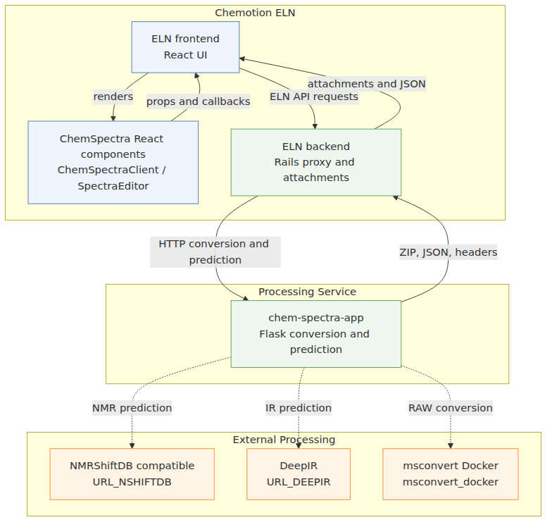
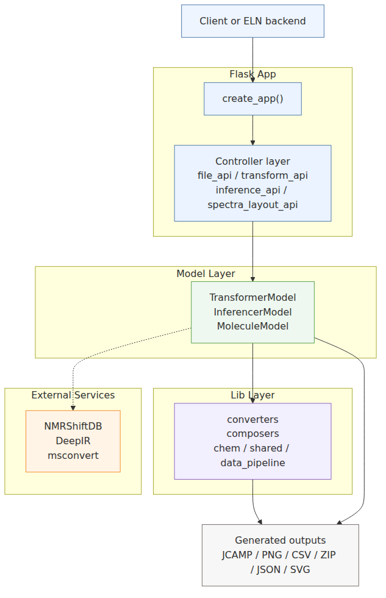
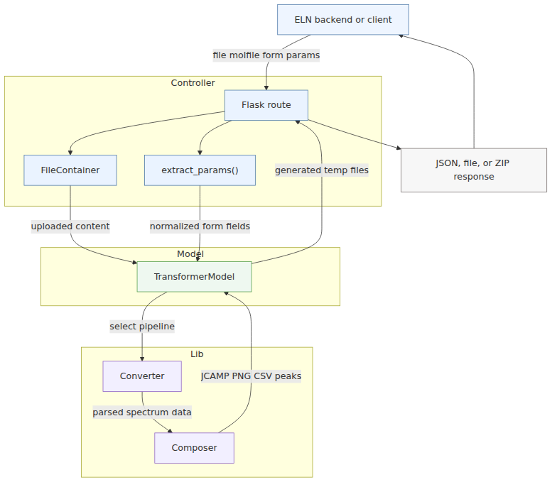

# ChemSpectra Backend Onboarding

This document is the first stop for a new developer joining this project. It explains what the backend does, how it fits into the ChemSpectra ecosystem, and where to start when you need to run, debug, or extend it.

## 1. What is this project?

`chem-spectra-app` is a Flask backend service for processing chemical spectroscopy files.

In simple terms, it receives spectroscopy data from a client, transforms that data into formats that ChemSpectra can display or store, and sometimes asks external prediction services to analyze the data.

The project solves these practical problems:

- Convert uploaded spectrum files into enriched JCAMP files.
- Generate spectrum images, usually PNG files.
- Package generated files into ZIP responses.
- Extract or transform data from several spectroscopy formats.
- Run NMR, IR, and MS prediction workflows.
- Convert molecule files into useful molecule metadata such as SMILES, exact mass, and SVG drawings.

The main data types handled by this backend are:

- NMR spectra, including JCAMP and Bruker FID ZIP inputs.
- IR spectra, including prediction support through DeepIR.
- MS spectra, including RAW, mzML, mzXML, CDF, and JCAMP-based MS data.
- Other spectral or analytical data classified through `chem_spectra/lib/converter/jcamp/data_type.json`, such as XRD, cyclic voltammetry, DSC, DLS, UV/VIS, HPLC UV/VIS, Raman, and related formats.
- Molecule files, handled with RDKit.
- NMRium JSON, for supported 1D spectrum conversion.

The backend processes uploaded files in request-scoped workflows. Generated artifacts are returned to callers, and in the Chemotion ELN integration they are persisted by the ELN backend as attachments.

## 2. Where does it fit in the global system?

This backend is part of the ChemSpectra ecosystem.

The repository shows these system boundaries:

- Chemotion ELN embeds ChemSpectra through React components.
- The frontend packages expose React APIs through props and callbacks, including `ChemSpectraClient` for standalone pages and `SpectraEditor` for spectrum editing inside the ELN.
- Chemotion ELN's Rails backend acts as the proxy and orchestrator for HTTP calls to `chem-spectra-app`.
- `chem-spectra-app` exposes HTTP endpoints used by the ELN backend to convert files, refresh spectra, save generated outputs, fetch spectra layouts, and run predictions.
- The backend calls external services for NMR and IR prediction.
- The backend depends on an `msconvert` service/container for RAW mass spectrometry conversion.

Runtime integration:

1. The ELN frontend renders `SpectraEditor` with decoded JCAMP data, molecule data, metadata, and predictions.
2. User actions trigger React callbacks such as `operations.value(payload)`, `forecast.btnCb(...)`, and `addOthersCb(...)`.
3. The ELN frontend sends requests to the ELN Rails backend, including `/api/v1/attachments/...` and `/api/v1/chemspectra/...`.
4. The ELN backend sends HTTP requests to `chem-spectra-app`, including conversion, prediction, NMRium, image-combination, and spectra-layout routes.
5. `chem-spectra-app` returns ZIP or JSON responses, with additional metadata in headers such as `x-extra-info-json`.
6. The ELN backend extracts files, stores or processes them as attachments, and returns JSON to the frontend.

In the ELN integration path, HTTP communication with `chem-spectra-app` is handled by the ELN Rails backend.

At a high level, the system works like this:

  

Important external integrations:

- `URL_NSHIFTDB` is used by `chem_spectra/model/inferencer.py` for NMR predictions.
- `URL_DEEPIR` is used by `chem_spectra/model/inferencer.py` for IR predictions.
- `msconvert_docker` is called by `chem_spectra/lib/converter/ms.py` for RAW mass spectrometry conversion.
- `Dockerfile.p2d` and `docker-compose.p2d.yml` describe a containerized setup with an app service and an `msconvert` service.

## 3. High-level architecture

The project is a single Flask backend split into practical layers.

  

### Controller layer

The controller layer lives in `chem_spectra/controller/`.

It is responsible for HTTP concerns:

- reading request files and form fields;
- calling the right model;
- returning JSON, files, or ZIP archives;
- aborting with HTTP errors when input cannot be handled.

For the full layer and file mapping, see `docs/architecture.md`.

### Model layer

The model layer lives in `chem_spectra/model/`.

It is responsible for application-level decisions:

- choose the right conversion path;
- call external prediction services;
- parse molecule files through RDKit;
- connect controllers to lower-level converters and composers.

The three classes to know first are:

- `TransformerModel` in `chem_spectra/model/transformer.py`;
- `InferencerModel` in `chem_spectra/model/inferencer.py`;
- `MoleculeModel` in `chem_spectra/model/molecule.py`.

### Lib layer

The lib layer lives in `chem_spectra/lib/`.

It contains the domain-specific work:

- converters read source formats and normalize them;
- composers generate output files such as JCAMP, PNG, and CSV;
- chemistry helpers draw molecules and detect functional groups;
- shared helpers manage temporary files and calculations.

Most difficult spectroscopy behavior is implemented here, especially in:

- `chem_spectra/lib/converter/`;
- `chem_spectra/lib/composer/ni.py`;
- `chem_spectra/lib/composer/ms.py`;
- `chem_spectra/lib/composer/base.py`.

## 4. How a request works

Most conversion requests follow the same shape:

This is the onboarding view. For step-by-step runtime behavior and debugging checkpoints, see `docs/core-flows.md`.

1. A client uploads a spectrum file, often with a molfile and form parameters.
2. The controller wraps uploaded files in `FileContainer`.
3. `extract_params()` reads form fields and builds a parameter dictionary.
4. The controller creates `TransformerModel`.
5. `TransformerModel` chooses a converter and composer based on the file extension or `params['ext']`.
6. A converter reads the source data.
7. A composer generates output files.
8. The controller returns JSON, a direct file, or a ZIP archive.

  

For prediction requests, the flow is similar but `InferencerModel` is involved:

- NMR predictions call `URL_NSHIFTDB`.
- IR predictions standardize the spectrum and call `URL_DEEPIR`.
- MS predictions use locally extracted peaks from the MS composer.

## 5. Main concepts to understand before coding

### `TransformerModel`

`TransformerModel` is the main gateway for file transformation.

Before changing conversion behavior, read `chem_spectra/model/transformer.py`. The most important method is `to_composer()`.

What a developer should know:

- It decides which pipeline to use from the uploaded filename extension or `params['ext']`.
- RAW, mzML, and mzXML files go through `MSConverter` and `MSComposer`.
- CDF files go through CDF converters and then `MSComposer`.
- ZIP inputs are routed as Bruker FID data or BagIt archives when those structures are detected.
- JCAMP-like text data goes through `JcampBaseConverter`.
- Some branches also handle simulated NMR data and invalid molfile reporting.

If a change affects supported file formats, start here.

### `InferencerModel`

`InferencerModel` coordinates prediction workflows.

Before changing prediction behavior, read `chem_spectra/model/inferencer.py`.

What a developer should know:

- NMR prediction sends data to `URL_NSHIFTDB`.
- IR prediction sends standardized spectrum data and functional groups to `URL_DEEPIR`.
- MS prediction is local and uses `tm.prism_peaks()`.
- The model returns response objects shaped for the API controllers.
- External service failures can become user-facing `503` style responses.

If a change affects NMR, IR, or MS prediction, start here and then check `chem_spectra/controller/inference_api.py`.

### `MoleculeModel`

`MoleculeModel` is the RDKit wrapper.

Before changing molecule behavior, read `chem_spectra/model/molecule.py`.

What a developer should know:

- It reads molfile content.
- It creates a RDKit molecule.
- It computes SMILES and exact molecular mass.
- It generates SVG drawings.
- For `1H` NMR decoration, it adds hydrogens and computes 2D coordinates.
- It can detect functional groups through `chem_spectra/lib/chem/ifg.py`.

If a feature depends on molfile validity, molecule drawings, functional groups, or exact mass, start here.

### Converters vs composers

Converters and composers are different roles.

Converters read source data:

- `JcampBaseConverter` reads JCAMP and classifies the spectrum type.
- `MSConverter` reads RAW, mzML, and mzXML workflows.
- `CdfBaseConverter` and `CdfMSConverter` handle CDF mass spectra.
- `FidBaseConverter` and `FidHasBruckerProcessed` handle Bruker FID data.
- `BagItBaseConverter` handles BagIt archives.
- `NMRiumDataConverter` handles supported NMRium JSON data.

Composers generate output:

- `BaseComposer` contains common JCAMP output building blocks.
- `NIComposer` handles NMR and many non-MS spectrum outputs.
- `MSComposer` handles mass spectrum output and peak extraction.

The practical rule:

- If you need to read a new input format, look at converters.
- If you need to change generated JCAMP, PNG, CSV, labels, peaks, or metadata, look at composers.